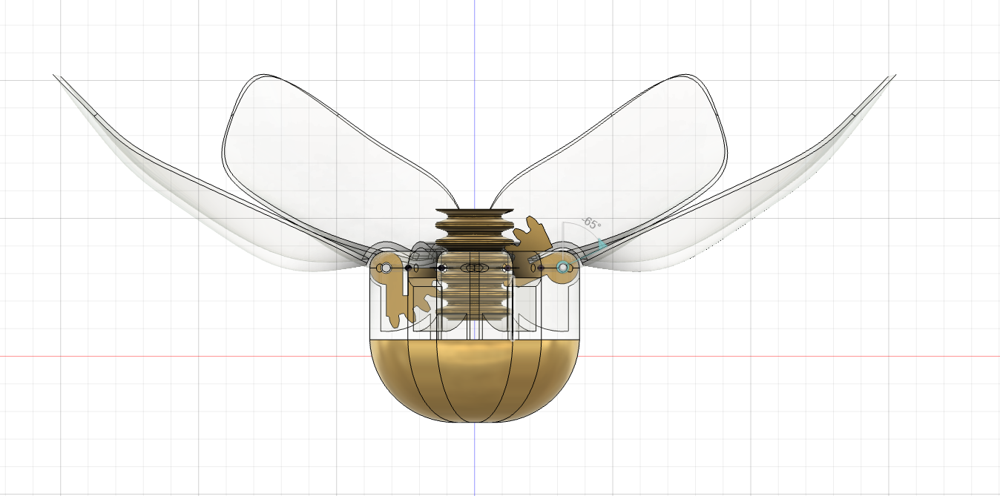
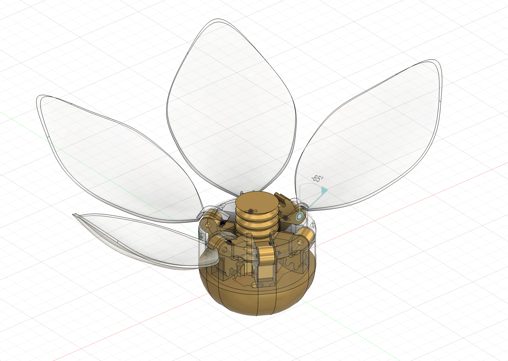
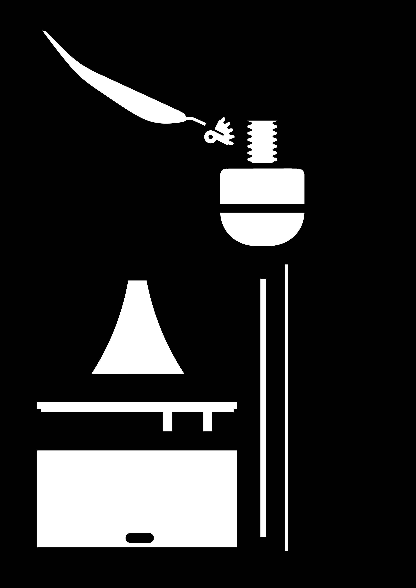
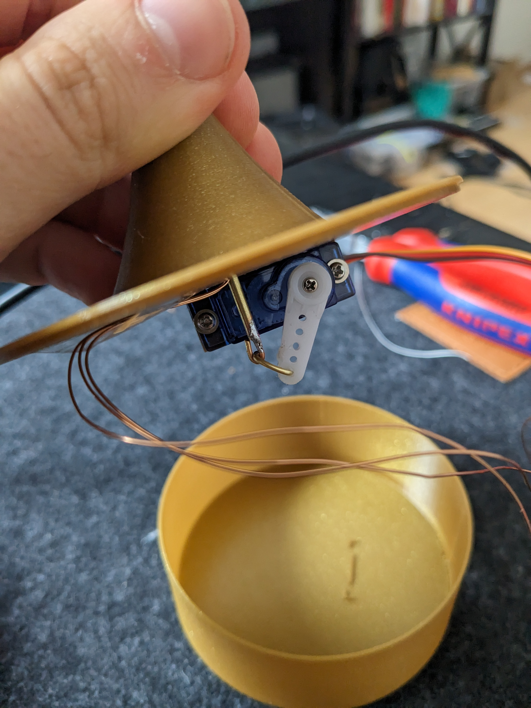
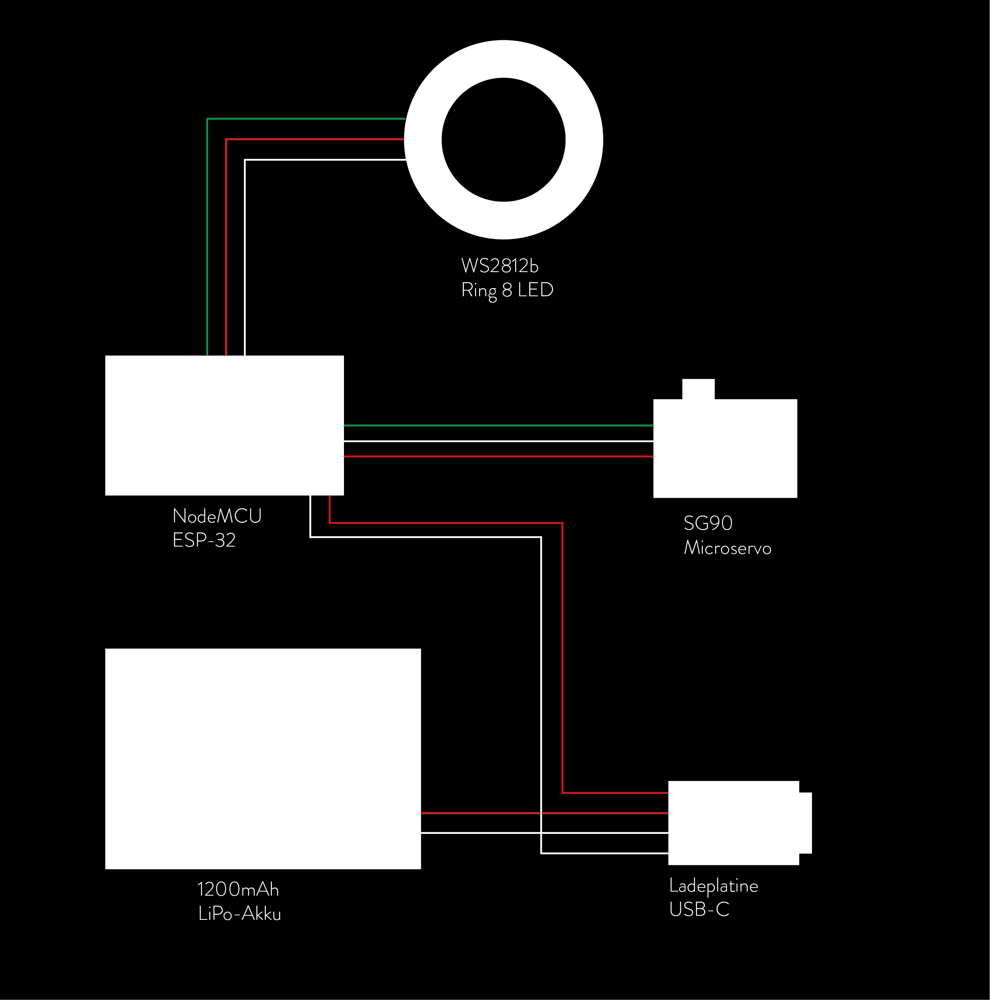
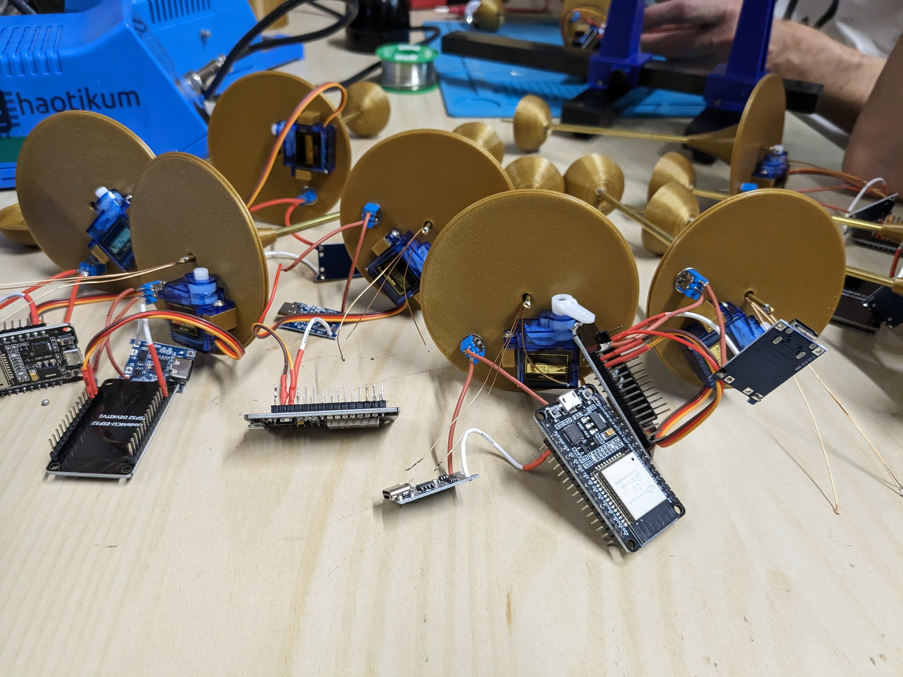
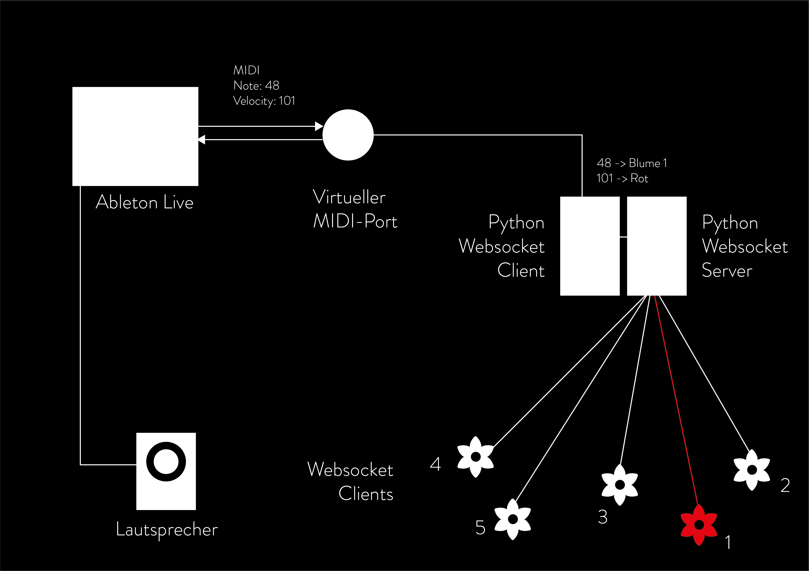

# STROMBLÜTE

STROMBLÜTE ist eine multimediale Installation, die mit Roboterblumen Aufmerksamkeit für aussterbende Pflanzenarten erweckt. Hier wird der Aufbau kurz erklärt.

## fertige Blume

## STL

## 3D-gedruckte Bestandteile
Jede Stromblüte besteht aus 8 verschiedenen (18 einzelnen) 3d-gedruckten Bestandteilen. 
Jedes Blütenblatt besteht aus einem Zahnradteil und dem tatsächlichen Blütenblatt. Der Blütenkopf besteht aus 3 Teilen – einer Basis, einem durchsichtigen Kopfteil und einem runden Zahnradstempel. Die Basis baut sich aus einem Hohlkörper, einem Deckel und einem Stützzylinder auf. Sie beinhaltet fast alle elektronischen Elemente. Zusätzlich werden zwei ineinanderpassende Messingrohre (4 mm und 2 mm Durchmesser) benötigt. Der Stab mit 2 mm Durchmesser muss 2,5 cm länger als der Stab mit 4 mm sein. Ansonsten kann die Länge nach belieben gewählt werden. Für das Verbindungselement zwischen Stab und Motor habe ich Messingdraht verwendet. Hier muss ein Ring an den längeren Stab gelötet werden und ein Haken zwischen Motor und Ring gelegt werden. 

### Baumarkt

* [Messingstab 4 mm](https://www.bauhaus.info/metallprofile-kunststoffprofile/kantoflex-rundrohr/p/10505983)
* [Messingstab 2 mm](https://www.bauhaus.info/metallprofile-kunststoffprofile/kantoflex-rundrohr/p/10505976)
* [Messingdraht](https://www.bauhaus.info/draehte/stabilit-draht/p/10198620?adb_search=messingdraht)

## Elektronik

In jeder einzelnen Blume sind 5 Elektronikelemente verbaut. Die Steuerung übernimmt ein NodeMCU mit dem Modul ESP-32, der über einen Lithium-Polymer-Akku betrieben wird. Der Akku kann mithilfe einer Ladeplatine über USB-C geladen werden. Der Mikrocontroller steuert einen LED-Ring mit 8 LEDs und einen kleinen Servomotor, welcher für das Öffnen und Schließen der Blütenblätter zuständig ist.

### Beispiele für die Elektronikteile
* [ESP32 Development Board](https://www.berrybase.de/esp32-nodemcu-development-board)
* [RGB-LED Ring](https://www.berrybase.de/neopixel-ring-mit-8-ws2812-5050-rgb-leds)
* [LiPo-Akku](https://www.berrybase.de/lp-503562-lithium-polymer/lipo-akku-3-7v-1200mah-mit-2-pin-jst-stecker)
* [Microservo](https://www.berrybase.de/sg92r-micro-servo)
* [USB-C Ladeplatine](https://www.berrybase.de/ladeplatine-fuer-3-7v-liion/lipo-akkus-mit-ausgang-usb-type-c-buchse-loetpads-1000ma)
* [Schalter](https://www.ebay.de/itm/183827874396)

## Netzwerk

Um jede Blume einzeln ansteuern zu können, muss jede Blume auf ein Signal des Computers reagieren können. Die Komposition der öffnenden und schließenden Blumen läuft dabei über den Musikstandard MIDI. Diese MIDI-Note-Signale werden über die Digital Audio Workstation (DAW) Ableton Live erzeugt und an einen Virtuellen Midi Port gesendet. Dieser gibt das Signal zurück an die DAW, um einen Ton zu erzeugen und wird gleichzeitig über ein Python Programm ausgelesen. Jede einzelne Blume ist per WLAN mit dem Python Websocket Server verbunden und reagiert auf das ihr zugeordnete MIDI-Signal. 

